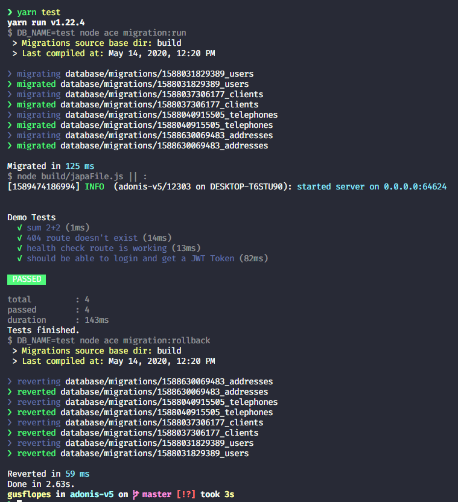

# Setting up Tests with Adonis V5 and Japa
Just after release of Adonis V5 Preview I've being playing around and developing a few projects with AdonisJs. There was a lack of documentation at start but that is being solved by the *Adonis JS Core Team*.

Right now we don't have any documentation about testing on Adonis V5, but after some research on AdonisJs code, and with some help from @virk on theirs Discord channel I came up with this initial setup for testing.

## Table of Contents
* [Intro](#setting-up-tests-with-adonis-v5-and-japa)
* [Table of Contents](#table-of-contents)
* [Instructions](#instructions)
  + [Install dependencies](#install-dependencies)
  + [Create a database for tests](#create-a-database-for-tests)
  + [Create a settings files](#create-a-settings-file)
  + [Update your package.json](#Update-your-package.json)
  + [Write your first test](#Write-your-first-test)
  + [Running your tests](#Running-your-tests)
* [Thanks](#thanks)


## Instructions
At the end of this small tutorial you should be able to set up testing using Japa + Supertest on an Adonis V5 project. We could use that setup for writing unit test and integration tests, but right now I'm focusing on **integrations tests**.

### Install dependencies
The first step is to install the dependencies that we will need to the tests we plan to write
```bash
yarn add -D japa supertest get-port
```

### Create a database for tests
There are many approaches you could take. For this tutorial, we are creating integrations tests and we will hit the Database just to make sure everything is working.

To make this work, we create a database on the same SQL Server we use. In my case, I just created a database called `test` on my Postgres Container.

### Create a settings file
Adonis and Japa uses a file called `japaFile.ts` to handle all the test configurations. This is my current template for that:

```ts
import 'reflect-metadata'
import getPort from 'get-port'
import { configure } from 'japa'
import sourceMapSupport from 'source-map-support'

sourceMapSupport.install({ handleUncaughtExceptions: false })

configure({
  files: ['build/test/**/*.spec.js'],
  before: [async () => {
    const port = await getPort()
    process.env.PORT = String(port)
    process.env.DB_NAME = 'test'

    const { Ignitor } = await import('@adonisjs/core/build/src/Ignitor')
    await new Ignitor(__dirname).httpServer().start()
  }],
  after: [async () => {
    console.log('Tests finished.')
  }],
  bail: false,

})
```

### Update your package.json
To make it easier to run the tests, I make the following changes to the package.json:
```json
scripts: {
  /* Previous script commands */
  "pretest": "DB_NAME=test node ace migration:run",
  "test": "node build/japaFile.js || :",
  "posttest": "DB_NAME=test node ace migration:rollback"
}
```

With these settings we make sure to use the DB **"tests"**. The **pretest** and **posttest** will run the latests migrations before the tests run, and then revert all changes made to database. We can use the same database for all apps since we clean up everything when we finish testing.

### Write your first test
Now we just need to add the tests to the folder **tests** it will be compiled from .ts to .js by Adonis V5. We can use this simple example:

```ts
// ./tests/demo.spec.ts
import test from 'japa'
import supertest from 'supertest'
const BASE_URL = `http://${process.env.HOST}:${process.env.PORT}`
const request = supertest(BASE_URL)
// import User from 'App/Models/User'
// import db from '@ioc:Adonis/Lucid/Database'

test.group('Demo Tests', (group) => {
  test('sum 2+2', (assert) => {
    assert.deepEqual(2 + 2, 4)
  })

  test('404 route doesn\'t exist', async (assert) => {
    const { text } = await supertest(BASE_URL).get('/thisRouteDoesntExist').expect(404)
    assert.exists(text, 'handled E_ROUTE_NOT_FOUND: Cannot GET:/asdlas')
  })

  test('health check route is working', async (assert) => {
    const {status, text} = await supertest(BASE_URL).get('/health')
    assert.equal(status, 200)
    assert.exists(text, '"healthy":true')
  })
})
```

If you try to run this, the first two tests should pass and the third one will only work if you already set up a health check route.
You could look the code on the repository linked at the end of this tutorial where we implement the **HealthCheck Route** and also a test that **hits the database**.

### Running your tests
Before running the tests, we just need to make sure the files are already compiled from **.ts** to **.js**
You can just use the same compiler used for development running `node ace serve --watch`.
This commands not only starts the server, but it also compiles the Typescript code and keep watching for changes, compiling the changes. So if it is not running, when you try to run recently modified tests, it'll not read the changes.

To prevent that behavior, we just need to do this:

1- Run `node ace serve --watch`

2- Run `yarn test` on a different 

And that's it!

## Thanks
That's it!

After running the tests you should see something like this:

<p align="center">
  
</p>

You can also take a look on the following [code](https://github.com/gusflopes/adonis-v5/commit/b352f42079f3cd15ed13af13c64bb6d793f369dd) where I implement tests on my sample repository.

After that I made a few adjustments, you can just take a look at the [current version](https://github.com/gusflopes/adonis-v5) of the repository for more insights.

---

Built by [gusflopes](https://github.com/gusflopes) with [AdonisJs](https://preview.adonisjs.com/).